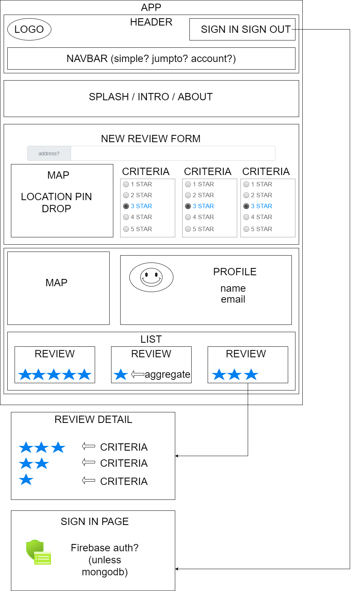

# 
**Got2Go, a Yelp Clone (only less evil, and for bathrooms)**

#### 
*A REACT Native mobile project, created for Epicodus coding school as a final capstone of the program*

#### 
**By &copy; [Scott O'Neil](https://github.com/spnoneil), 5/7/2021**

 
 
 

## NOTE: PROJECT FAR FROM COMPLETE, IF SEEING THIS AND NOT AN EPICODUS TEACHER, PLEASE DISREGARD.

## Description
_A React Native mobile SPA, utilizing {TODO:database, MongoDB or Firestore} and Google Maps API, to create a crowd-sourced rating system for bathrooms_

## Setup/Installation Requirements

* _INSTALL INSTRUCTIONS TO COME, YOU **DON'T** WANT TO INSTALL THIS YET_

## Component Tree

## Technologies Used

* _JavaScript ES6 / REACT Native / Expo_
* _Firebase / Firestore_
* _VS Code 1.54.2_
* _HTML5/CSS3/Tailwind?_

## Known Bugs

* _No known bugs, as its not real yet_

## Future implementation
* _Everything_

## License

## Contact Information

_Issues can be reported [here](https://github.com/spnoneil/Got2GoAgain/issues/new) on GitHub, though it feels QUITE rude to do so at this present state_